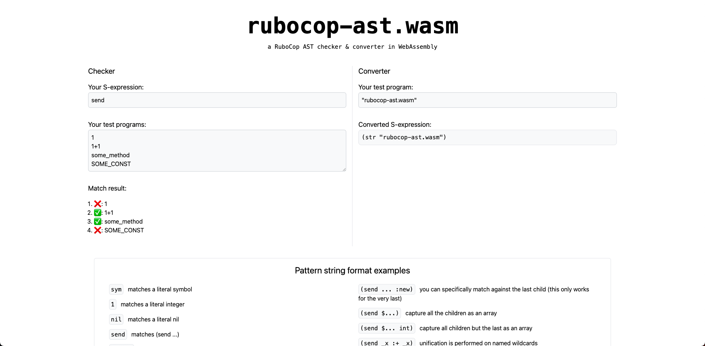

# rubocop-ast.wasm

a RuboCop AST checker & converter in WebAssembly.

https://rubocop-ast-wasm.vercel.app/



## Development

```shell
# Make public/rubocop-ast.wasm
$ cd rubocop-ast.wasm
$ rake
$ cd ..

# Start web application
$ yarn
$ yarn dev
```

## Acknowledgements

- https://github.com/tnantoka/rubocop-on-wasm
- https://github.com/kateinoigakukun/irb.wasm
- https://github.com/ruby/ruby.wasm
